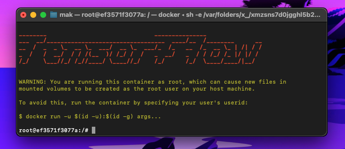
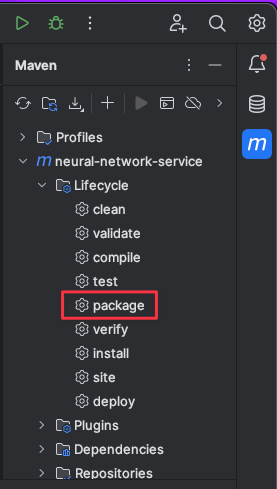
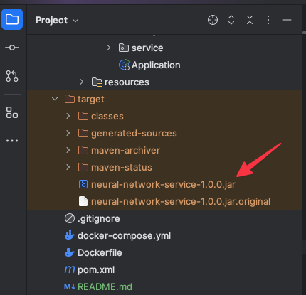
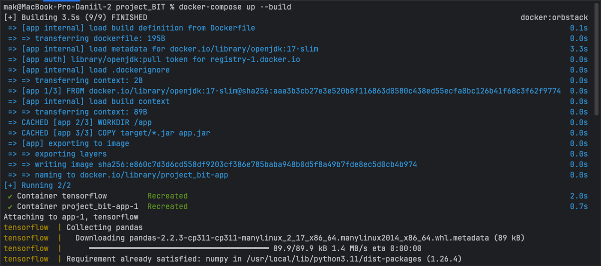
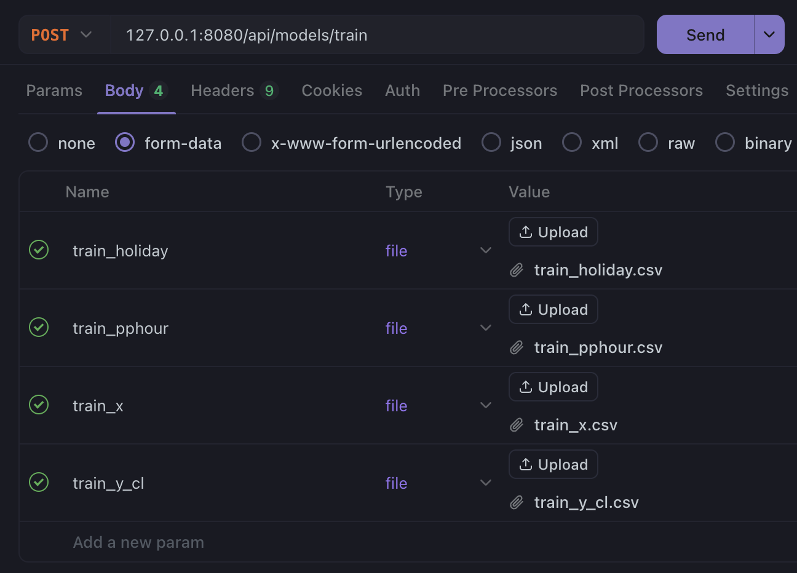
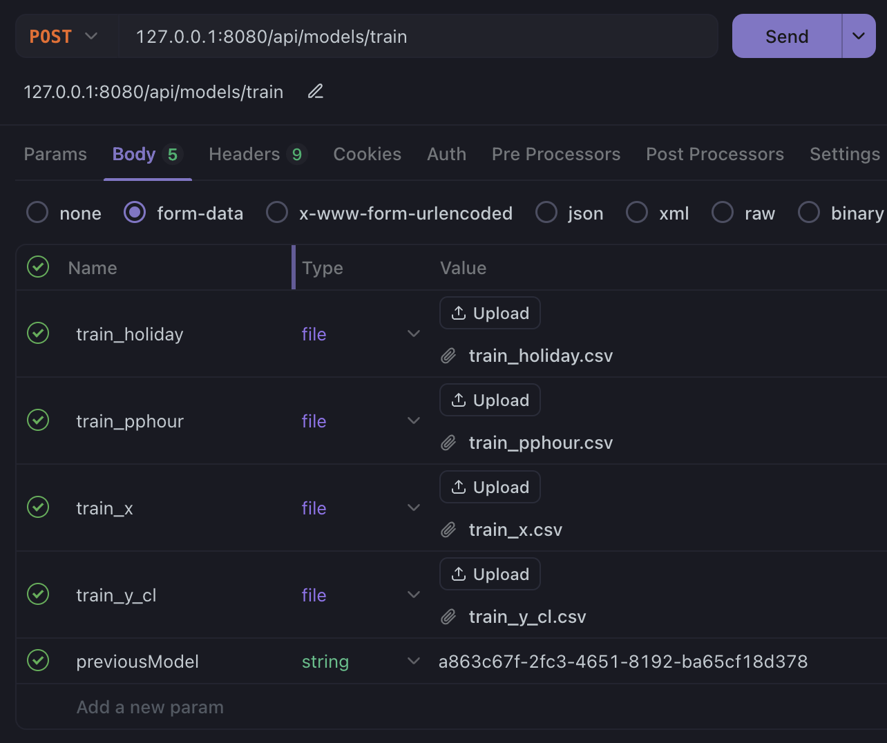

# Базовая настройка сервиса

1. Установить Docker Desktop или OrbStack
2. Склонировать репозиторий
3. Открыть терминал и скачать tensorflow
```bash
docker pull tensorflow/tensorflow:latest
```
4. Протестить работает ли он запустив его
```bash
docker run -it --rm -p 8888:8888 tensorflow/tensorflow:latest
```
Зайдя в терминал должно быть примерно так


5. В скачанном репозитории зайти в настройки maven и сбилдить проект


7. В проекте должна появится папка target и jar файл


8. В терминале проекта копмозим в докер контейнер весь проект. Должно быть что-то типо такого:
```bash
docker-compose up --build
```


Протестировать можно в Postman, Apidog и подобных:

**Обучение модели с нуля:**

POST запрос на 
```
127.0.0.1:8080/api/models/train
```
с отправкой в body:

**Key** - train_holiday (File), Value - файл с обучающими данными (csv) 

**Key** - train_pphour (File), Value - файл с обучающими данными (csv)

**Key** - train_x (File), Value - файл с обучающими данными (csv)

**Key** - train_y_cl (File), Value - файл с обучающими данными (csv)


Ответ при успешном обучении: id модели

**Дообучение модели на основе существующей:**

POST запрос на
```
127.0.0.1:8080/api/models/train
```
с отправкой в body:

**Key** - train_holiday (File), Value - файл с обучающими данными (csv) 

**Key** - train_pphour (File), Value - файл с обучающими данными (csv)

**Key** - train_x (File), Value - файл с обучающими данными (csv)

**Key** - train_y_cl (File), Value - файл с обучающими данными (csv)

**Key** - previousModel (Text), Value - id модели


GET запрос на
```
127.0.0.1:8080/api/models/{id}
```
Ответ: скачается zip архив с моделью по id

Данные для обучения:
[csv folder](csv.zip)

Скрипт для обучения нейронной сети:
[work-data folder](work_data.zip)