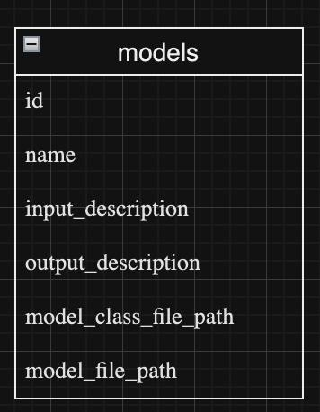
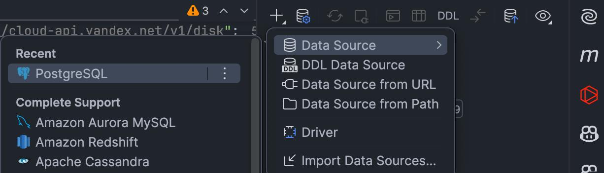
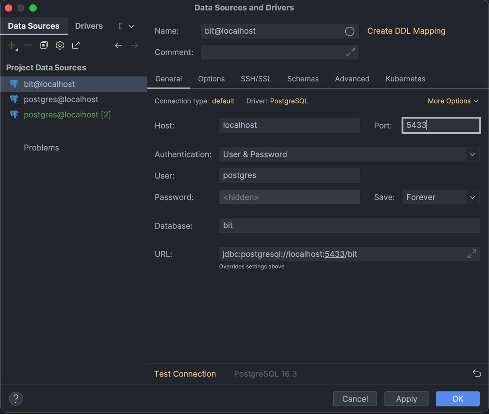
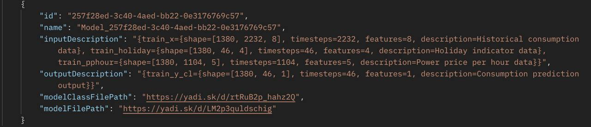

# <p style="text-align:center;">**Хранение моделей в PostgreSQL**</p>

Для хранения моделей после обучения и дообучения используется база данных PostgreSQL. Модели хранятся в таблице `models` с такими полями:



## Структура таблицы `models`

- **id**: Генерируется автоматически с использованием генератора UUID (через Hibernate)
- **Name**: Название модели
- **input_description**: Описание входных данных модели
- **output_description**: Описание выходных данных модели
- **model_class_file_path**: Путь к файлу класса модели (.pb) на Яндекс Диске
- **model_file_path**: Путь к директории модели на Яндекс.Диске

## Подключение к базе данных

Для работы с базой данных необходимо добавить DataSource в конфигурацию проекта



Указываем порт `5433` для развертывания в Docker контейнере.



## Просмотр моделей в базе данных

После обучения модели можно посмотреть, как она хранится в базе данных, с помощью GET-запроса:

```
127.0.0.1:8080/api/models/{id}
```



- Входные и выходные данные модели хранятся в формате JSON. Эти файлы содержат описание того, какие данные модель принимает на вход и какие результаты ожидаются
- Модель сама сохраняется на Яндекс.Диске. В базе данных хранятся пути, по которым можно найти модель и её файл класса (например, `.pb` файл), расположенные на Яндекс.Диске
